# 🌿 ReLoop - Campus Sustainability Trading App

> A mobile-first web app empowering students to trade, swap, and recycle items to reduce campus waste.

   

---

## 💡 What It Does

ReLoop solves the problem of campus waste by creating a closed-loop economy for students. Instead of throwing away old textbooks, furniture, or clothes, students can easy "re-loop" them back into the community.

**The Loop:**
1.  **Scan an item** to instantly see its eco-impact and upcycling potential.
2.  **Trade or Swap** with other students nearby.
3.  **Earn Eco-Coins** and level up your sustainability profile.

---

## 🚀 Main Features

### 🛒 The Marketplace
A dedicated space for your campus. Browse what others are giving away or selling. Filter specifically for student needs like **Textbooks**, **Dorm Essentials**, and **Electronics**.

### 🔍 AI Scanner
Not sure if something is recyclable? Just snap a photo. Our AI identifies the object and tells you:
*   Its material composition.
*   Carbon saved by recycling/reusing it.
*   Creative DIY ideas to upcycle it.

### 🏆 Gamification
Sustainability shouldn't be boring. ReLoop turns eco-friendly actions into a game.
*   **Leaderboards**: Compete with your dorm or friends.
*   **Missions**: Complete daily eco-challenges.
*   **Badges**: Show off your achievements like "Zero Waste Hero".

---

## 🛠️ How It's Built

We built ReLoop with a modern, scalable tech stack focused on performance and user experience.

*   **Next.js 16 (App Router)**: For fast, server-side rendered pages and robust routing.
*   **React 19**: Utilizing the latest features like Server Actions for seamless data handling.
*   **Tailwind CSS v4**: For a completely custom, responsive design without the bloat.
*   **Cloudflare Workers AI**: Powered by Llama 3.2 Vision for instant image analysis.
*   **Firebase**: Handling real-time authentication and database needs.

---

## 🔄 App Flow

```mermaid
graph TD
    User([Student]) -->|Opens App| Dashboard
    
    Dashboard -->|Wants to Trade| Marketplace[🛒 Marketplace]
    Dashboard -->|Has Item| Scanner[🔍 AI Scanner]
    Dashboard -->|Check Progress| Profile[🏆 Profile]

    Marketplace -->|Connects| Trade(Swap Item)
    Scanner -->|Analyzes| Results(CO2 Data & Ideas)
    Profile -->|Views| Stats(Leaderboard & Badges)
```



---

## ⚡️ Quick Start

To run this project locally:

```bash
# 1. Clone the repo
git clone https://github.com/yourusername/reloop-nextjs.git
cd reloop-nextjs

# 2. Install packages
npm install

# 3. Start the server
npm run dev
```

Open [http://localhost:3000](http://localhost:3000) to view the app.

---

## 📄 License

MIT License.
